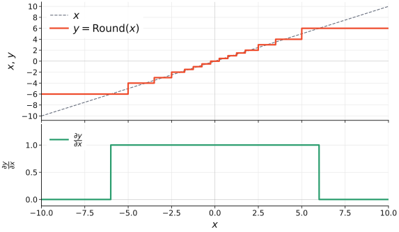
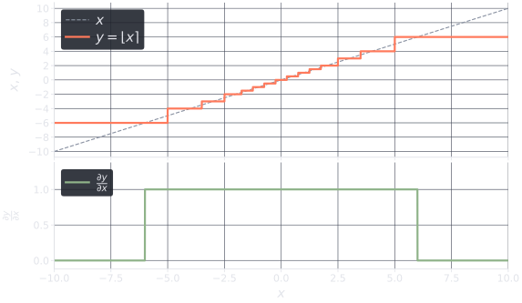
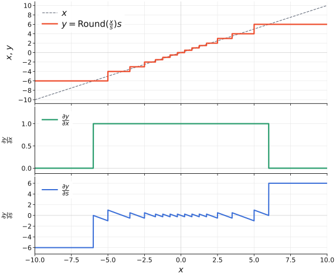
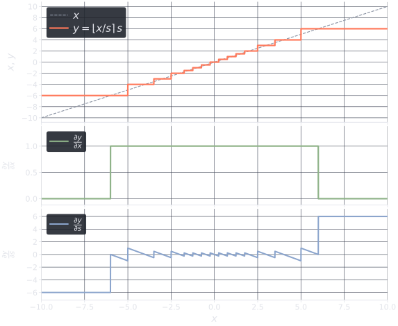

# Autograd

Nearest rounding \(\lfloor x\rceil\) is a staircase, so the true derivative is \(0\) almost everywhere. Training uses a **clipped straight-through estimator** (STE): identity through the bins, zero in saturation. The C++/CUDA kernel is forward-only; `StraightThroughEstimator` is the autograd wrapper. `Round` is that map onto `fp.values`.

## Element-wise

\[
y = \lfloor x\rceil,
\qquad
\frac{\partial y}{\partial x}
=
\mathbf{1}_{x \in [x_{\min},\, x_{\max}]}.
\]

\(x_{\min}\) and \(x_{\max}\) are `fp.minimum` and `fp.maximum`. Incoming \(\partial L/\partial y\) is **not** clipped to that range.

<div class="autograd-fig" markdown="span">
{ .light }
{ .dark }
</div>

```python
y = Round(fp)(x)
y.sum().backward()  # x.grad is 1 inside range, 0 outside
```

## Block-scaled

\[
y_i = \left\lfloor\frac{x_i}{s}\right\rceil s.
\]

Absmax mode detaches \(s\). Learnable `scales=` keeps \(s\) in the graph. The gate is on \(x/s\), not on \(x\):

\[
\frac{\partial y_i}{\partial x_i}
=
\mathbf{1}_{x_i/s \,\in\, [e_{\min},\, e_{\max}]},
\qquad
\frac{\partial y_i}{\partial s}
=
\begin{cases}
\left\lfloor x_i/s \right\rceil - x_i/s
  & \text{if } x_i/s \in [e_{\min},\, e_{\max}], \\[0.35em]
\left\lfloor x_i/s \right\rceil
  & \text{otherwise}.
\end{cases}
\]

The second branch is \(y = e\,s\) with \(\partial e/\partial s = 0\) (clipped STE). See [Block scale](block.md) for absmax vs `scales=`.

<div class="autograd-fig" markdown="span">
{ .light }
{ .dark }
</div>

## Other estimators

Keep the **forward** (outputs must stay on `fp.values`). Replace only **backward**. Save the pre-clamp \(x\); do not `fill_` the caller's tensor.

Quantization-aware training still starts from the straight-through estimator. MAD, ReSTE, and RDFS change how \(\partial L/\partial y\) is masked or scaled. LSQ keeps the element Jacobian and learns \(s\) — already `BlockRound(..., scales=s)`.

| Surrogate | Backward | Reference |
| --- | --- | --- |
| Clipped STE | \(\mathbf{1}_{[x_{\min},x_{\max}]}\) | Default here |
| Learned step size quantization (LSQ) | STE on \(\lfloor\cdot\rceil\); \(\partial y/\partial s = \lfloor x/s\rceil - x/s\) | [Esser et al., 2020](https://arxiv.org/abs/1902.08153) — already used for \(s\) in `BlockRound` |
| Element-wise gradient scaling (EWGS) | \(g\,(1+\delta\,\operatorname{sgn}(g)\,(x-y))\) on the clip gate | [Lee et al., 2021](https://arxiv.org/abs/2104.00903) |
| Magnitude-aware differentiation (MAD) | \(1\) in range; \(x_{\max}/\lvert x\rvert\) in saturation | [Sakr et al., 2022](https://arxiv.org/abs/2206.06501) |
| Rectified STE (ReSTE) | \(\frac{1}{o}\lvert x\rvert^{1/o-1}\) on the clip gate | [Wu et al., 2023](https://arxiv.org/abs/2308.06689) |
| Rotated damped Fourier surrogate (RDFS) | Cosine STE of \(\lfloor\cdot\rceil\); identity when amplitude \(A=0\) | [Chen et al., 2026](https://arxiv.org/abs/2601.19320) |

## EWGS example

EWGS scales the clipped STE by the rounding error; \(\delta=0\) is the default. The paper also adapts \(\delta\) from a Hessian trace — extra state, not shown. Save \(y\) as well as \(x\). Wrap with a learnable \(s\) to put \(\partial y/\partial s\) in the graph (the figure is \(s=1\)). Drag \(\delta\); \(0\) is clipped STE. Fixed values around \(10^{-3}\)–\(10^{-2}\) are what [Lee et al.](https://arxiv.org/abs/2104.00903) used on a unit-interval quantizer — on E2M1 they sit on top of STE, so the slider default is \(1\) to make the sawtooth visible:

<div class="ste-widget" data-estimator="ewgs" data-src="../assets/ewgs-slider.json">
  <noscript>
    <div class="autograd-fig">
      
      
    </div>
  </noscript>
  <div class="ste-widget__stage">
    <canvas role="img" aria-label="EWGS Round with learnable s = 1. Drag delta to update the gradients."></canvas>
  </div>
  <div class="ste-widget__controls">
    <label for="ewgs-delta">δ</label>
    <input id="ewgs-delta" class="ste-widget__slider" type="range" min="0" max="1" step="0.001" value="1" aria-valuemin="0" aria-valuemax="1">
    <output class="ste-widget__value" for="ewgs-delta" data-ste-value aria-live="polite">1</output>
    <div class="ste-widget__chips">
      <button type="button" class="ste-widget__chip" data-value="0">0 (STE)</button>
      <button type="button" class="ste-widget__chip" data-value="0.001">10⁻³</button>
      <button type="button" class="ste-widget__chip" data-value="0.01">0.01</button>
      <button type="button" class="ste-widget__chip" data-value="0.1">0.1</button>
      <button type="button" class="ste-widget__chip" data-value="1">1</button>
    </div>
    <p class="ste-widget__hint">Forward is unchanged. Only ∂y/∂x and ∂y/∂s depend on δ.</p>
  </div>
</div>

```python
from floating_point.round import Round, StraightThroughEstimator

DELTA = 1.0  # 0 recovers clipped STE


class EWGS(StraightThroughEstimator):
    @staticmethod
    def forward(ctx, x, dtype, min, max):
        y = StraightThroughEstimator.forward(ctx, x, dtype, min, max)
        ctx.save_for_backward(x, y)
        return y

    @staticmethod
    def backward(ctx, grad_output):
        x, y = ctx.saved_tensors
        if x.grad_fn is not None and x.grad_fn.__class__.__name__ == ctx.__class__.__name__:
            raise RuntimeError("Double quantization detected.")
        in_range = (x >= ctx.min) & (x <= ctx.max)
        scale = 1 + DELTA * grad_output.sign() * (x - y)
        grad_x = grad_output * scale * in_range.to(dtype=grad_output.dtype)
        return grad_x, None, None, None


class EWGSRound(Round):
    def forward(self, x):
        fp = self.data_type
        return EWGS.apply(x, fp, fp.minimum, fp.maximum)


s = torch.tensor(1.0, requires_grad=True)
y = EWGSRound(fp)(x / s) * s
y.sum().backward()  # x.grad: EWGS on x/s; s.grad: product rule
```

## ReSTE example

ReSTE puts a power on the clip gate; \(o=1\) is clipped STE. [Wu et al.](https://arxiv.org/abs/2308.06689) used this for \(\operatorname{sgn}\) (BNNs) and ramped \(o\) from 1 to 3 — extra schedule, not shown. Clamp \(|x|\) so the spike at 0 is finite. The axis is cut at 6; for \(o>1\) the peak is off-scale. Wrap with a learnable \(s\) as in EWGS if you want \(\partial y/\partial s\).

<div class="ste-widget" data-estimator="reste" data-src="../assets/ewgs-slider.json">
  <div class="ste-widget__stage">
    <canvas role="img" aria-label="ReSTE Round. Drag o to update the gradient."></canvas>
  </div>
  <div class="ste-widget__controls">
    <label for="reste-o">o</label>
    <input id="reste-o" class="ste-widget__slider" type="range" min="1" max="3" step="0.01" value="2" aria-valuemin="1" aria-valuemax="3">
    <output class="ste-widget__value" for="reste-o" data-ste-value aria-live="polite">2</output>
    <div class="ste-widget__chips">
      <button type="button" class="ste-widget__chip" data-value="1">1 (STE)</button>
      <button type="button" class="ste-widget__chip" data-value="2">2</button>
      <button type="button" class="ste-widget__chip" data-value="3">3</button>
    </div>
    <p class="ste-widget__hint">Forward is unchanged. o=1 is clipped STE. The spike at 0 is clipped on this axis.</p>
  </div>
</div>

```python
from floating_point.round import Round, StraightThroughEstimator

O = 2.0  # 1 recovers clipped STE


class ReSTE(StraightThroughEstimator):
    @staticmethod
    def forward(ctx, x, dtype, min, max):
        y = StraightThroughEstimator.forward(ctx, x, dtype, min, max)
        ctx.save_for_backward(x)
        return y

    @staticmethod
    def backward(ctx, grad_output):
        (x,) = ctx.saved_tensors
        if x.grad_fn is not None and x.grad_fn.__class__.__name__ == ctx.__class__.__name__:
            raise RuntimeError("Double quantization detected.")
        in_range = (x >= ctx.min) & (x <= ctx.max)
        jac = (1.0 / O) * x.abs().clamp(min=1e-4).pow(1.0 / O - 1.0)
        grad_x = grad_output * jac * in_range.to(dtype=grad_output.dtype)
        return grad_x, None, None, None


class ReSTERound(Round):
    def forward(self, x):
        fp = self.data_type
        return ReSTE.apply(x, fp, fp.minimum, fp.maximum)


y = ReSTERound(fp)(x)
y.sum().backward()
```

## RDFS example

First-order rotated damped Fourier surrogate (\(M=0\)). \(A=0\) is clipped STE. [Chen et al.](https://arxiv.org/abs/2601.19320) and the [StableQAT](https://github.com/microsoft/StableQAT/blob/main/models/utils_quant.py) `fft1` configs use \(A=0.21\), below the pole at \(1/(\sqrt{2}\pi)\). Their kernel evaluates \(\cos\bigl(\pi(v+\lfloor v\rceil)\bigr)\) on the LSQ integer \(v=x/s\). Here \(v\) is the `Round` input, so the cosine assumes unit bins; E2M1 steps are not unit-spaced, and the ripples do not sit on every step.

<div class="ste-widget" data-estimator="rdfs" data-src="../assets/ewgs-slider.json">
  <div class="ste-widget__stage">
    <canvas role="img" aria-label="RDFS Round. Drag A to update the gradient."></canvas>
  </div>
  <div class="ste-widget__controls">
    <label for="rdfs-a">A</label>
    <input id="rdfs-a" class="ste-widget__slider" type="range" min="0" max="0.21" step="0.001" value="0.21" aria-valuemin="0" aria-valuemax="0.21">
    <output class="ste-widget__value" for="rdfs-a" data-ste-value aria-live="polite">0.21</output>
    <div class="ste-widget__chips">
      <button type="button" class="ste-widget__chip" data-value="0">0 (STE)</button>
      <button type="button" class="ste-widget__chip" data-value="0.1">0.1</button>
      <button type="button" class="ste-widget__chip" data-value="0.21">0.21</button>
    </div>
    <p class="ste-widget__hint">Forward is unchanged. A=0 is clipped STE. First-order (M=0); cosine assumes unit bins.</p>
  </div>
</div>

```python
from floating_point.round import Round, StraightThroughEstimator

A = 0.21  # 0 recovers clipped STE


class RDFS(StraightThroughEstimator):
    @staticmethod
    def forward(ctx, x, dtype, min, max):
        y = StraightThroughEstimator.forward(ctx, x, dtype, min, max)
        ctx.save_for_backward(x, y)
        return y

    @staticmethod
    def backward(ctx, grad_output):
        x, y = ctx.saved_tensors
        if x.grad_fn is not None and x.grad_fn.__class__.__name__ == ctx.__class__.__name__:
            raise RuntimeError("Double quantization detected.")
        in_range = (x >= ctx.min) & (x <= ctx.max)
        a = A * (2.0 ** 0.5) * torch.pi
        c = torch.cos(torch.pi * (x + y))
        jac = (1 - a * c) / (1 + a * c)
        grad_x = grad_output * jac * in_range.to(dtype=grad_output.dtype)
        return grad_x, None, None, None


class RDFSRound(Round):
    def forward(self, x):
        fp = self.data_type
        return RDFS.apply(x, fp, fp.minimum, fp.maximum)


y = RDFSRound(fp)(x)
y.sum().backward()
```

Do not wrap `Round` inside another `Function` — nested `Round` on the same tensor raises `Double quantization detected.` `BlockRound` instantiates `Round` internally, so these subclasses are not used for NVFP4/MX until `BlockRound` takes a custom rounder.
